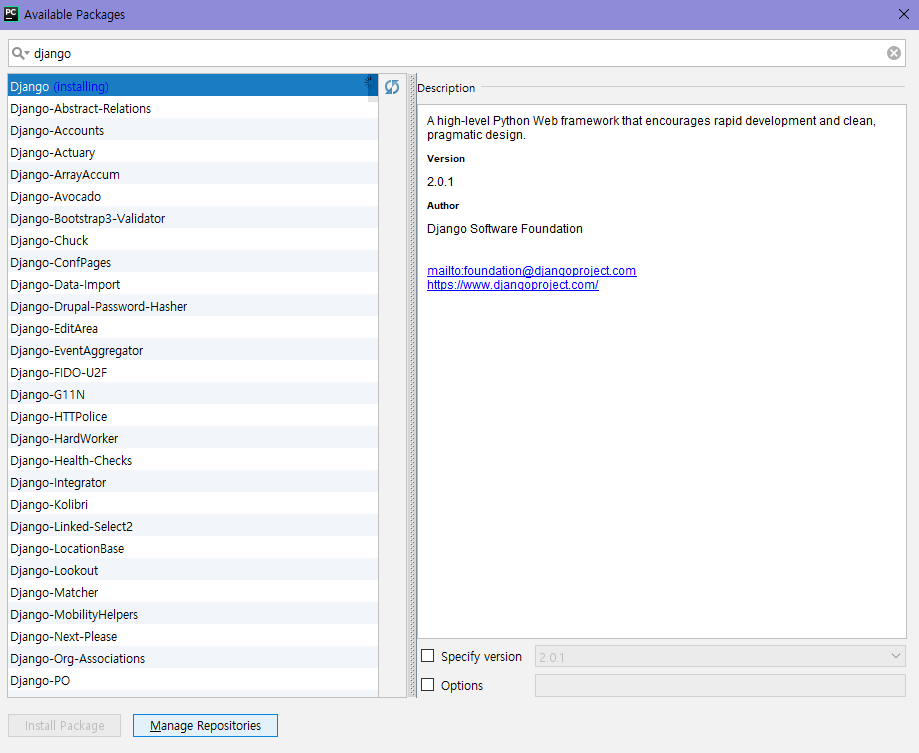

### python install
***
 1. `wget https://www.python.org/ftp/python/3.6.4/Python-3.6.4.tgz`
 	- Web Get' wget 웹 상의 파일을 다운로드 받을 때 사용
 2. `tar xvzf Python-3.6.4.tgz`  
  - 압축 하기 tar -cvzf `압축될 이름` `압축할 파일/폴더명`, 압축 풀기 tar -xvzf `압축 해제할 파일`
 3. `cd Python-3.6.4`
 >
 4. ./configure
  - 소스를 받아서 컴파일할 때 ./configure 스크립트를 이용하여 Makefile 만듬
	- Makefile : 파일 간의 종속관계를 파악하여 shell 명령이 순차적으로 실행되게 만듬
